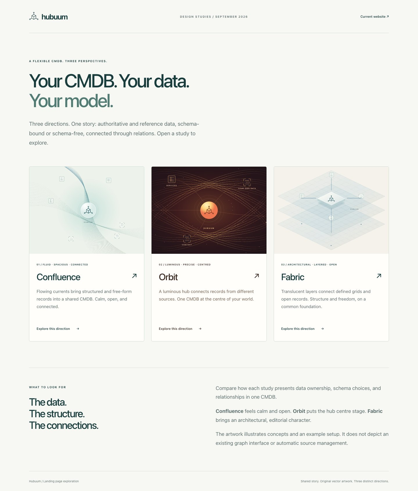

# Connected landing page studies

Three reviewable directions for the Hubuum root website, drafted from fresh
`origin/main` at `2afd7563356ad704e293011c040cbcaad782ba9a` on branch
`design/connected-landing-concepts`.

## Open the drafts

Open [the gallery](index.html) in a browser, or serve this directory locally
with Python 3.11 or newer:

```sh
python3 -m http.server 8873 --bind 127.0.0.1 --directory design
```

Visit <http://127.0.0.1:8873/>. The HTML pages also work when opened directly
from disk. There are no dependencies, external fonts, analytics, or build steps
needed to view them. GitHub's file viewer displays HTML source; use the local
preview or the screenshots below to see the designs.

| Study | Direction | Full desktop page | Full mobile page |
| --- | --- | --- | --- |
| [01 Confluence](confluence.html) | Fine currents gather at a common centre. Warm white, deep teal, generous space. | [Desktop](previews/confluence-desktop.jpg) | [Mobile](previews/confluence-mobile.jpg) |
| [02 Orbit](orbit.html) | A luminous hub within a constellation. Deep ember, gold, orange, and coral, with a centred opening. | [Desktop](previews/orbit-desktop.jpg) | [Mobile](previews/orbit-mobile.jpg) |
| [03 Fabric](fabric.html) | Connected, translucent planes. An architectural composition with editorial typography. | [Desktop](previews/fabric-desktop.jpg) | [Mobile](previews/fabric-mobile.jpg) |



## What to compare

- How clearly the opening presents Hubuum as a flexible CMDB.
- Equal emphasis on authoritative/reference data, schema choices, and relations.
- The transition from the opening promise into the product explanation.
- The balance of abstract imagery and concrete resource examples.
- Which typography, colours, and overall feeling best fit the project.

The studies use concise copy and body text enlarged by 25% through the shared
`--body-text-scale` setting. Example cards stack earlier on smaller screens to
give the larger text room.

Each study opens with **Your CMDB. Your data. Your model.** The scrolling story
introduces the kinds of data you can manage, authoritative records and upstream
reference data, schema-bound and schema-free classes, relations, and the ecosystem.
The authority section explains data maintained in Hubuum and data collected from
upstream systems without named object examples.
Authority and structure are independent choices: both schema approaches can hold
either kind of data. The example model illustrates all four combinations.
The schema-bound Atlas card demonstrates strings, integers, decimal numbers,
booleans, arrays, and nested objects from the shared corpus, with a link to the
[JSON Schema specification](https://json-schema.org/specification).
The Classes / Objects / Relations / Access controls work with a mouse, touch, or arrow keys.
Classes define resource types and their schema policy; objects are instances of
those classes, with their own JSON data.
The content is readable without JavaScript, and reduced-motion preferences
disable the short entrance effects. There is no scroll interception.

The network illustrations and small hub symbol are original SVG explorations.
Defined record grids and open record outlines represent schema-bound and
schema-free content. Source labels in the example diagram describe the ownership
chosen for those examples; they are not screenshots of provenance features.
They illustrate concepts; they do not imply an existing graph UI, automatic
discovery, or built-in source synchronisation. The copy explicitly assigns
collection and refresh to the user's integrations. Product links lead to the
existing documentation entry points and preserve the release-default policy.

## Shared source

- `page.html.template` holds the shared page structure and product story.
- `gallery.html.template` holds the comparison page.
- `assets/site.css` contains one shared stylesheet with scoped visual variants.
- `assets/site.js` progressively enhances the tabs and entrance effects.
- `render.py` defines the three concepts and draws their vector imagery.

The system font stack and original teal foundation follow the shared documentation
theme in `hubuum/.github`, pinned at
`c026918decd83c681fedf0c4c61c266284ae4020`. Orbit explores a warmer palette throughout
its page, illustrations, and favicon, using the same layout and illustration
geometry. These standalone studies do not load the documentation layout CSS.
Once a direction is chosen, shared brand rules can live in that theme, with
landing-specific layout in this repository.

Regenerate committed HTML and SVG after editing their source:

```sh
python3 design/render.py
```

The renderer uses only the Python standard library and requires Python 3.11+.
Edit the templates, renderer, or shared assets rather than generated HTML/SVG.
`assets/favicon.svg` is hand-authored; it is not generated by the renderer.
The renderer derives Orbit's warm favicon from that shared icon.
The screenshots are browser captures for review, not a generated build input.

## Scope

These files live outside `docs/` and are not included in the current Zensical
build or Pages publishing pipeline. No live page, documentation navigation,
shared tooling pin, release archive, or production CSS changes in this branch.
This is a design exploration, with no released user-facing impact and no
changelog entry required. Selection and production integration are a later step.

Design references: [Stripe's visual progression](https://stripe.com/),
[Linear's typographic restraint](https://linear.app/), and
[Tailscale's approachable explanations](https://tailscale.com/).
All artwork and page implementation here are original.
